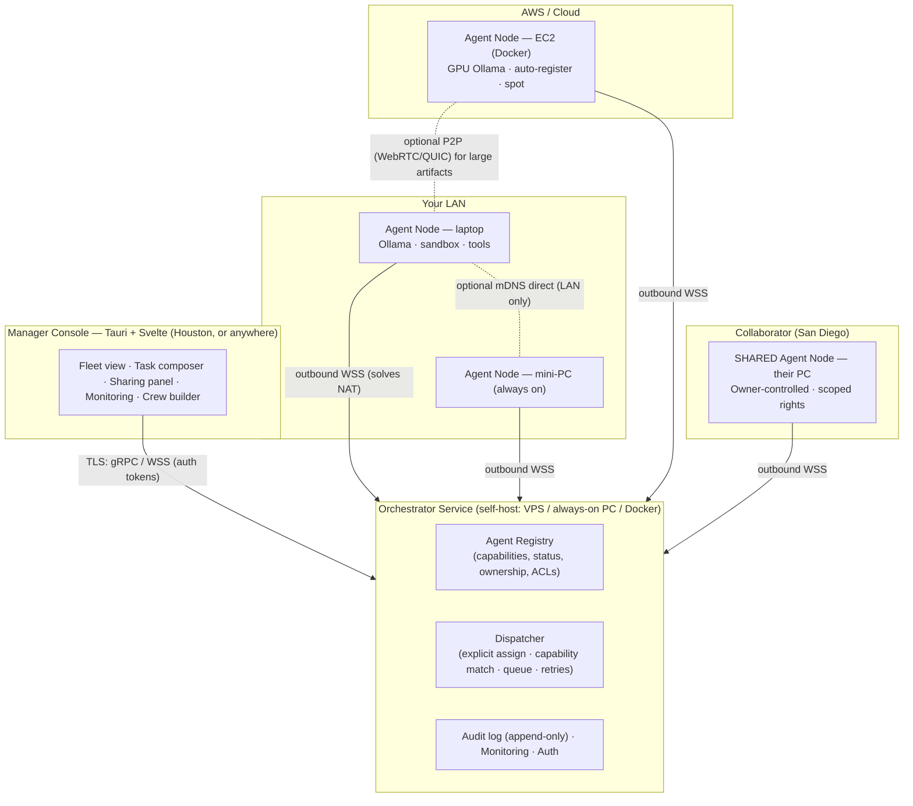
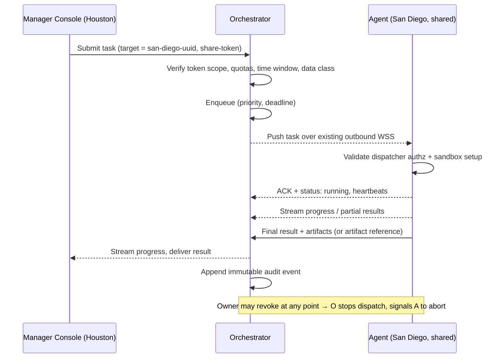
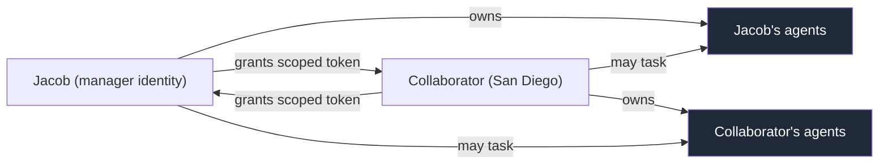
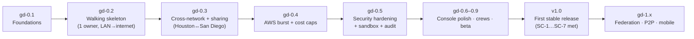

# Gruper Distributed — AI Workforce Platform

## A note on versioning (read this first)

**Gruper Distributed is not at v1.0, and this document is not a "v2" spec.**

The earlier draft of this document labeled itself "v2.0." That was wrong. Gruper *core* is at v0.4.5; the distributed extension described here has **not shipped anything yet**. There is no v1.

To keep this honest and unambiguous, this project uses an explicit pre-release track:

| Track | Meaning |
|-------|---------|
| **`gd-0.1` … `gd-0.9`** | Pre-release design + build milestones for Gruper Distributed. This is where we are. |
| **`gd-1.0` (v1.0)** | **Declared only when the first stable release ships** — installable agent runtime, working orchestrator, working cross-network sharing, security model in place, and real users running it. The roadmap is rewritten at that point to reflect that we have *reached* v1. |
| **`gd-1.x+`** | Post-v1 hardening, federation, ecosystem. |

So when you see version numbers in this document, they refer to **pre-1.0 milestones unless explicitly stated otherwise.** "v1.0" is always a *future* target — a finish line for the first release, not the starting line. The roadmap (Section 11) is built around that finish line.

> The product name "Gruper Distributed" is a **working name**, not a final decision. See the reflection at the end for alternatives.

---

## Executive Summary

**Gruper Distributed** extends the proven local agent patterns of Gruper core into a secure, local-first platform for deploying and orchestrating fleets of AI agents that act as virtual employees, managers, researchers, analysts, and automation specialists.

Gruper core today runs up to six configurable AI agents in a single browser file, talking to a local Ollama/LocalAI backend, with conversation memory, consensus detection, analytics, and a streamlined glassmorphism UI. It is deliberately client-only and single-file. Gruper Distributed keeps that local-first ethos but answers a question core cannot: *what if the agents don't all have to run on this one machine, on this one network?*

**The defining breakthrough of this design** is that agents are no longer confined to a single user's local network:

- **LAN agents** — desktops, laptops, and always-on mini-PCs (Intel NUC, Beelink) on your own network.
- **Cloud agents** — AWS EC2 instances (Dockerized, auto-registering, spot-friendly), including GPU inference instances for heavy local-model work.
- **Permissioned cross-user agents** — *the headline capability.* You, in Houston, can add a trusted collaborator's computer in San Diego as an assignable agent in your fleet and task it directly. They can do the same with yours. The remote machine appears in your Manager Console as a first-class, scoped resource — no shared LAN, no port forwarding, no screen sharing, no VPN setup required.

This turns idle personal hardware plus cheap cloud burst into an **elastic, location-independent AI workforce grid.** Tasks — research, report generation, data analysis, workflow execution, document drafting, customer simulation — can be explicitly assigned to a specific remote agent or routed to a capability-matched pool, with live monitoring, queuing, result streaming, and a full audit trail across ownership and geographic boundaries.

The system prioritizes **privacy** (Ollama local inference first), **security** (sandboxing, fine-grained sharing ACLs, instant revocation, optional end-to-end encryption), **usability** (one Tauri desktop console, one-click installers, QR/share-token onboarding), and **integration with the existing stack** (n8n workflows, RadioDoge bridge, SteloPTC-style structured data discipline).

Target users mirror Stelminado's own world: a solo operator scaling toward a 10–20 person consulting/business footprint, small trusted teams, pharma/biotech labs needing reliable structured processes, and collaborator networks who want to share compute *without* surrendering control to a centralized SaaS.

---

## 1. Vision, Goals, Non-Goals & Success Criteria

### 1.1 Vision

A trusted person — not a faceless cloud — should be able to lend you an AI worker. Your fleet should span your desk, your closet mini-PC, a spot GPU in `us-west-2`, and a friend's gaming rig two time zones away, and it should *feel like one console*. Local and private by default; distributed and elastic when you choose; always under explicit, revocable, auditable control.

### 1.2 Primary Goals

- **True distributed agent execution** across heterogeneous environments and ownership boundaries — LAN, cloud, and other people's machines.
- **The "not just my own network" requirement, concretely:** a Manager Console in Houston can task an agent on a collaborator's PC in San Diego, or on AWS GPU instances in `us-west-2`, over the public internet, with no inbound networking on the agent side.
- **Symmetric, owner-controlled sharing** — vice-versa assignment with strong scoping and an instant kill switch.
- **Leverage existing hardware** — idle employee/collaborator laptops, gaming PCs, home servers — plus cheap cloud burst (spot, idle-time GPU).
- **Keep sensitive workloads local or on explicitly trusted nodes;** use cloud only for non-sensitive parallel work, by policy.
- **Build on what already works** — Gruper's local agent/conversation patterns and UX, SteloPTC's Tauri/Svelte discipline, and the current n8n + Ollama automation.

### 1.3 Non-Goals (for the pre-1.0 track)

- **No fully decentralized / blockchain marketplace.** A public, trustless compute grid with token incentives is explicitly out of scope until well after v1.
- **No open, anyone-can-join grid.** Sharing starts **closed and invite-only**. Strangers cannot dispatch to your machines.
- **No execution of arbitrary untrusted code from people you don't trust.** Everything runs sandboxed and ACL-gated; the trust model assumes a *known* collaborator circle.
- **No replacement of Gruper core.** Core stays single-file, client-only, and standalone. Distributed is a *separate companion system* that reuses core's patterns and (optionally) embeds core's UI — it does not require core to grow a backend.
- **No mobile-first console** before the desktop console is solid (mobile monitoring is a later add).

### 1.4 Success Criteria (what "good" looks like before we even talk about v1)

| # | Criterion | Target |
|---|-----------|--------|
| SC-1 | Time to add a remote agent (San Diego PC or AWS) to a fleet and receive its first task with end-to-end result return | **< 5 minutes** from install |
| SC-2 | Dispatch overhead for a remote task (excluding actual model execution) | **< 5–10 s** typical |
| SC-3 | Owner revocation of a shared agent takes effect | **Immediately** — no new tasks accepted, in-flight tasks killable |
| SC-4 | All traffic authenticated + encrypted + auditable | **100%** of connections; no anonymous dispatch |
| SC-5 | Works behind consumer NAT, corporate firewalls, and AWS without inbound ports | **No port forwarding ever required on agents** |
| SC-6 | Sensitive task never leaves an unauthorized boundary | **Policy-enforced**; confidential tasks only routed to compliant agents |
| SC-7 | Field laptop loses internet mid-task | **Local queue survives**, syncs on reconnect, no data loss |

These criteria are the *acceptance bar for the first stable release.* When they all hold for real users, that is when we discuss declaring v1.0.

---

## 2. Key Use Cases

### UC-1 — Cross-City Direct Assignment (Houston ↔ San Diego) — *the defining case*
You (Houston) have a multi-hour research + synthesis task. Your collaborator in San Diego runs the agent runtime on a 64 GB / RTX 4090 desktop. From your Manager Console you assign the task **directly to their machine**. Their agent executes against their local Ollama (or a model you specify), streams progress, and returns the final report plus artifacts. You never RDP, screen-share, or touch their network config. They granted you a scoped share token; they can revoke it in one click.

### UC-2 — Hybrid Local + Cloud Burst
Daily lightweight interactive agents run on your laptop and home mini-PC (low latency, private). For a big parallel job, you launch 4× AWS spot instances as `DataCruncher` agents. They auto-register on boot, appear in your fleet, accept partitioned work, and self-terminate on idle timeout or when the queue drains — with a hard budget cap.

### UC-3 — Employee / Contractor Compute Contribution
A part-time researcher in another state installs the desktop agent on their personal laptop. You grant them the right to submit *certain task types* to *your* agents; they grant you the right to assign *research tasks* to *their* machine **during agreed hours only**. Mutual benefit, explicit boundaries, both sides auditable.

### UC-4 — Hierarchical Manager Agents
A "Lead Researcher" meta-agent on your always-on orchestrator node decomposes a goal, assigns sub-tasks to the best available agents (local for quick context, the San Diego high-RAM box for heavy lifting, AWS for parallel web research), aggregates results, and produces the final output. A human manager assigns to the manager agent; the manager agent assigns to worker agents — including across ownership boundaries, within the policies it's allowed to use.

### UC-5 — Resilience / Offline Tolerance (rural TX, travel)
A field laptop loses internet. Locally-targeted tasks keep running from a local queue. When connectivity returns, it reconciles with the orchestrator (results uploaded, new assignments pulled). Optionally, the **RadioDoge LoRa bridge** carries tiny coordination messages when there's no internet at all.

### UC-6 — Lab / Compliance Workflow (ties to SteloPTC + biotech mindset)
Structured, reliable, auditable pipelines: a protocol-optimization task is decomposed, run across agents, and every assignment/outcome is logged immutably for LLC recordkeeping. Confidential inputs are tagged and prevented from routing to non-compliant (e.g., non-US, non-on-prem) agents.

### UC-7 — On-the-Go Monitoring (Uber driving, travel)
A lightweight read-only view (later: PWA/mobile) lets you watch fleet status and approve human-gated actions from your phone between rides — without a laptop.

---

## 3. Architecture Overview

### 3.1 The one principle that makes cross-network work

**Every agent makes an *outbound* authenticated, persistent connection to an orchestrator.** Nothing ever connects *into* an agent. This single decision is what lets a San Diego desktop, a corporate-firewalled laptop, and an AWS instance all participate identically — outbound 443 is essentially always allowed, NAT is traversed by the agent dialing out, and the orchestrator becomes a reliable relay for pushing tasks and streaming results back. Direct peer-to-peer is an *optimization* layered on top later, never a requirement.

### 3.2 Component map



### 3.3 Request lifecycle (explicit cross-network assignment)



### 3.4 Trust topology (who can task whom)



---

## 4. Component Breakdown — Agent Runtime (Worker)

The Agent Runtime is the program that turns a machine into an assignable AI worker. It has two delivery paths (desktop and container) over **one shared core**.

### 4.1 Delivery paths

| Path | Targets | Packaging | Lifecycle |
|------|---------|-----------|-----------|
| **Desktop** | Windows / macOS / Linux laptops & desktops, mini-PCs | Tauri app + background service (systemd / launchd / Windows Service) | "Install as Agent Node" wizard; optional Ollama install; LAN mDNS optional |
| **Container** | AWS EC2, VPS, on-prem servers, NUC/Beelink | Multi-arch Docker image (CPU + CUDA variants) | `docker run` / Terraform / user-data; reads env secrets; auto-registers |

> **Cross-network enabler:** both paths do the *same outbound registration handshake*. A desktop in San Diego and an EC2 box in Oregon are indistinguishable to the orchestrator except for their reported capabilities and owner.

### 4.2 Installation UX

- **Desktop:** single download → **"Install as Agent Node"** → service installed, optional Ollama bootstrap, paste/scan an **orchestrator URL + registration token** (QR-code friendly for non-technical collaborators). Agent dials out, registers, appears in the owner's fleet within seconds.
- **AWS / container:**
  ```bash
  docker run -d --restart=unless-stopped \
    -e ORCHESTRATOR_URL=wss://orch.example.com \
    -e REGISTRATION_TOKEN=*** \
    -e AGENT_TAGS="datacruncher,us-west-2" \
    -e ROLE="data_analyst" \
    --gpus all \
    ghcr.io/stelminado/gruper-agent:cuda
  ```
  A Terraform module wraps this for spot fleets with budget caps and idle auto-termination.

### 4.3 Capabilities reported on registration

```json
{
  "agent_id": "uuid",
  "owner_id": "jacob-uuid",
  "name": "SanDiego-Workstation",
  "location_tag": "collab-san-diego",
  "jurisdiction": "US",
  "hardware": { "cpu_cores": 16, "ram_gb": 64, "gpu": "RTX 4090 24GB", "disk_gb": 2000 },
  "models": ["llama3.1:70b", "qwen2.5-coder:32b"],
  "tools": ["code_interpreter", "web_search", "file_read", "n8n_webhook"],
  "roles": ["researcher", "data_analyst"],
  "network": { "type": "residential", "latency_class": "medium" },
  "availability": { "windows": ["Mon-Fri 09:00-18:00 America/Los_Angeles"] },
  "runtime_version": "gd-0.1.0",
  "status": "idle",
  "last_heartbeat": "2026-06-27T00:00:00Z"
}
```

Capabilities feed the registry's matching index. `jurisdiction` and `availability` exist from day one because they are required for the sharing/compliance model, even if matching on them is simple at first.

### 4.4 Execution model

- Receives a task as JSON pushed over the existing outbound connection.
- Spins up an **isolated sandbox per task** (see §8.3).
- Primary inference: **Ollama** at the local endpoint, or a user-specified remote Ollama URL. OpenAI-compatible function calling so tools are portable.
- Agent loop: start with a **custom ReAct / plan-execute loop**; design the task/state schema so a graph engine (LangGraph-style) can be slotted in without breaking the wire contract. *(See §10 for the framework decision and its open question.)*
- Streams incremental progress, partial output, and a final result + artifacts back over the connection.
- Supports long-running tasks via **heartbeats and resumable checkpoints** (critical for UC-5 offline tolerance).

### 4.5 Sandboxing & safety (non-negotiable, expanded in §8)

- **Filesystem:** per-task temp dir; read-only access only to explicitly approved paths.
- **Network egress:** allow-list per role / per shared grant; can be empty (fully offline agent).
- **Code execution:** restricted Python/JS with timeout, memory cap, import restrictions, optional seccomp.
- **Approval gates:** high-impact actions (send email, external POST, spend) pause for human approval per policy.

---

## 5. Component Breakdown — Orchestrator Service

The orchestrator is the registry + dispatcher + auditor. It is the relay that makes cross-network assignment work without inbound agent ports.

### 5.1 Recommended stack

| Concern | Pre-1.0 choice | Rationale |
|---------|----------------|-----------|
| Core service | **Python + FastAPI** for the first milestones; **plan a Rust (axum/tonic) port of hot paths** as load and security review demand | Fastest path to a working cross-network demo using Python's agent ecosystem; Rust where safety/perf matter later. Matches the user's "prototype in Python, harden in Rust" preference. |
| Transport | **WSS** (WebSocket over TLS) for agent links; gRPC optional later | Universally NAT/firewall friendly; simple to implement and debug |
| Queue | **PostgreSQL** (`SKIP LOCKED` / `LISTEN-NOTIFY`) to start; Redis if throughput demands | One dependency, durable, auditable. Avoid premature Redis. |
| DB | **PostgreSQL** (multi-user). **SQLite + Litestream** is acceptable for a single-user self-host. | JSONB capability queries; easy self-host via Docker Compose |
| Deploy | **Docker Compose** on a cheap VPS or an always-on PC | One command self-host; no managed-cloud lock-in |

One orchestrator comfortably coordinates dozens to low-hundreds of agents — far beyond the 10–20-worker target.

### 5.2 Core responsibilities

- **Registry & lifecycle:** register, heartbeat, deregister; capability index for matching.
- **AuthN/AuthZ:** identity verification + **share-ACL enforcement** on every dispatch (§8).
- **Task intake:** from the console, the API, other agents (manager agents), or n8n webhooks.
- **Dispatch logic:**
  - **Explicit:** `assigned_agent_id = "san-diego-uuid"`.
  - **Capability/policy match:** "needs ≥ 32 GB RAM + `code_interpreter` + `researcher` role + `jurisdiction = US`."
  - **Cost/latency aware:** prefer local for interactive; AWS spot for batch.
  - **Queue management:** priorities, deadlines, retries, dead-lettering.
- **Result & artifact collection** with streaming to the submitter.
- **Audit logging:** immutable, append-only event stream.
- **Resilience hooks:** agent reconnection, offline reconciliation, optional multi-orchestrator registration (failover) — *interface present early, full federation later.*

### 5.3 Sharing / cross-user model — pick one for the first release

This is the single most consequential architectural choice. Two patterns:

**Pattern A — Shared multi-tenant orchestrator (RECOMMENDED for the first release)**
- One orchestrator instance (run by Jacob, or a small hosted service) serves multiple users.
- Each agent registers under its **owner's** namespace/organization.
- An owner mints a **time-limited, scoped share token** for a specific agent or group.
- The recipient imports the token in their console; the agent appears in their fleet with the granted scope (e.g., "research tasks only, max 5 concurrent, results visible but not raw logs").
- All traffic routes through the orchestrator; the owner keeps a global kill switch.
- **Why first:** makes "San Diego PC shows up in the Houston console" trivial, secure, and centrally auditable. Lowest moving-part count for the headline use case.

**Pattern B — Federated / direct-to-owner**
- Each user runs their own orchestrator.
- Sharing authorizes the recipient's orchestrator (or user) to dispatch to a specific agent; the agent multi-homes or the owning orchestrator proxies.
- More private and more resilient (no central party sees everything) but materially more complex.
- **Defer to a post-v1 phase.**

> **Recommendation:** ship **Pattern A** first. Design the data model and tokens so that **Pattern B is reachable later** (agents already speak "outbound to an orchestrator," so multi-homing is an additive change, not a rewrite). Mitigate Pattern A's central-trust weakness with **optional end-to-end payload encryption** (§8.4) so the orchestrator can relay confidential tasks it cannot read.

---

## 6. Component Breakdown — Manager Console

**Tech:** Tauri v2 + Svelte 5 + Tailwind (+ a small headless component layer). One codebase, native desktop feel, small bundle — consistent with SteloPTC and RadioDoge. The Console may **embed Gruper core's conversation UI** as the per-agent "talk to this worker" view, reusing existing, debugged UX rather than rebuilding it.

### 6.1 Key screens

| Screen | Purpose |
|--------|---------|
| **Fleet Overview** | Grid/list of all visible agents (owned + shared). Status, location tag, load, last-seen, ownership badge. Optional map view from `location_tag`. |
| **Agent Detail & Control** | Specs, current task, **live log stream**, history, "Assign New Task," and (for owned agents) "Manage Sharing." |
| **Task Composer** | Natural-language → structured task (AI-assisted parse) *or* form (prompt, input files, allowed tools, timeout, target = specific agent or "best match," priority, data class). |
| **Crew / Workflow Builder** | Graph where one agent's output feeds another — possibly on different machines/owners. Visual canvas + YAML/JSON import. |
| **Sharing Panel** | Generate/revoke tokens; see who can access your agents; set per-recipient scope (task types, quotas, time windows, approval requirements, data class). |
| **Monitoring & Analytics** | Success rate, latency by agent/location, AWS cost, utilization heatmaps, queue depth. Reuses Gruper core's Chart.js analytics patterns. |
| **AI Co-Pilot Mode** | Optional meta-agent suggests/auto-dispatches routine work per your policies. |

### 6.2 Mobile / on-the-go
A later **read-only PWA or Tauri-mobile** view for fleet status and urgent approval taps — explicitly tuned for the "approve while driving Uber" reality. Out of scope for the first release; the data model should not preclude it.

---

## 7. Component Breakdown — Communication & Cloud Integration

### 7.1 Communication layer (hybrid LAN + internet)

| Mode | Mechanism | When |
|------|-----------|------|
| **Internet / remote (always works)** | Agent dials **outbound WSS** to orchestrator on startup; maintains it with auto-reconnect, exponential backoff (mirrors Gruper core's 2/4/8/16 s pattern), offline queue; heartbeats keep NAT alive | **The default and the cross-network workhorse.** No inbound rules ever. |
| **LAN (zero-config, optional)** | mDNS/Bonjour discovery; direct WSS/QUIC for lowest latency | Local clusters in one home/office; speed optimization, not required |
| **Direct P2P (later)** | Orchestrator brokers ICE (STUN, optional TURN); WebRTC DataChannel / QUIC between agents after introduction; **falls back to relay** | Large artifacts, agent-to-agent handoff. Post-MVP. |

**Auth & encryption:** every connection authenticated (signed registration / short-lived token); TLS 1.3 everywhere; sensitive payloads optionally encrypted client-side to the **target agent's public key** for true E2E even on a shared orchestrator.

### 7.2 AWS / cloud integration

- Pre-built multi-arch Docker image (CPU + CUDA) with the agent runtime and optional bundled Ollama.
- Launch templates / Terraform for common types (`t3` light, `g4dn`/`g5` GPU; **spot by default**).
- On boot: read `ORCHESTRATOR_URL`, `REGISTRATION_TOKEN`, `AGENT_TAGS`, `ROLE` → auto-register → appear in fleet.
- **Cost controls (first-class, not afterthought):** idle-timeout auto-terminate; orchestrator "drain & stop" signal; hard per-pool budget caps with alerts; queue-depth-driven scaling via a small Lambda or scheduler.
- Portability: the same container runs on Hetzner, RunPod, or Vast.ai (cheap GPU) — one abstraction, many backends.

### 7.3 Tool & integration ecosystem

Agents expose an OpenAI-function-calling-compatible tool interface for portability.

| Tool | Notes |
|------|-------|
| `code_interpreter` | Sandboxed Python/JS, approved libs only |
| `web_search` | Tavily / self-hosted SearxNG / Brave; privacy toggle |
| `file_system` | Scoped read/write in task workspace or approved dirs |
| `n8n_webhook` / `http_request` | Trigger existing n8n workflows or any API |
| `email_send` / `slack_post` | Approval-gated, scoped creds |
| `vector_store` | Local LanceDB/Chroma per agent, or shared read-only KB |
| `radio_doge_send` | Optional bridge to LoRa mesh for resilient coordination (future) |

**n8n synergy:** agents become powerful "reasoning nodes" inside n8n workflows, and entire crews can be triggered from n8n; conversely n8n handles deterministic automation while agents handle reasoning/research. **RadioDoge bridge:** LoRa mesh carries tiny task/sync messages when the internet is down (UC-5).

---

## 8. Security, Privacy & Trust Model

This is the most important section for the cross-user requirement. The whole point is that you can hand someone a *scoped, revocable* worker — not root on your machine.

### 8.1 Identity & ownership
- Each user has a root identity: an **ed25519 keypair** (optionally OAuth-backed for recovery/UX).
- Each agent is **cryptographically bound to its owner** at registration.
- **Share tokens** are signed capability tokens (JWT or biscuit-style) encoding: target `agent_id`(s), grantee `user_id`, allowed actions, quotas, expiry, and conditions. They are presented on every dispatch and verified by the orchestrator.

### 8.2 Sharing & permissioning (the core of cross-user)
- **Owner is sovereign:** can view every task ever run on their agent, and **revoke instantly** — the orchestrator stops dispatching and signals the agent to drop/abort.
- **Granular scopes (examples):**

| Scope dimension | Example |
|-----------------|---------|
| Task categories | `["research","analysis","writing"]` — *not* `execute_arbitrary` or `email_external` |
| Resource limits | max 2 concurrent, ≤ 16 GB/task, ≤ 2 h runtime |
| Time windows | weekdays 09:00–18:00 owner-local only |
| Data classification | only tasks tagged `public` or `internal` |
| Result visibility | grantee sees final output, **not** intermediate logs/tool calls |
| Jurisdiction | grantee may not route `confidential` here if owner is non-US |

- The grantee's console shows shared agents with a **clear "shared / limited" indicator** and only the actions their token permits.

### 8.3 Sandbox & containment
Every task runs isolated with: separate FS namespace/tmpfs; dropped capabilities; seccomp/AppArmor/SELinux (desktop) or container defaults (cloud); a network egress allow-list (possibly empty); and cgroup-enforced CPU/memory/wall-time limits. **No task can touch another task's state or the host except through explicitly provided tools.**

### 8.4 Data protection
- Tasks tagged `confidential` route **only** to agents whose owner/jurisdiction/posture satisfy policy ("US only," "on-prem only," "encrypted at rest").
- With **E2E payload encryption to the target agent's public key**, a shared/central orchestrator relays content it cannot read — directly mitigating Pattern A's central-trust risk.
- Audit log records *who assigned what to which agent and the high-level outcome*; sensitive content is redacted or hashed.

### 8.5 Threat model & mitigations

| Threat | Mitigation |
|--------|------------|
| Malicious **shared agent** owner inspects your task | E2E payload encryption; never send confidential tasks to lower-trust agents; data-class routing |
| Malicious **grantee** abuses your agent | Per-grantee quotas, scopes, time windows; instant revoke; full audit |
| **Compromised orchestrator** | Agents execute only authorized, signed dispatches; E2E encryption protects content; LAN/local fallback mode |
| **Resource exhaustion** by shared users | Per-grantee + global caps; cgroup limits; queue fairness |
| **Supply chain** | Minimal base images, reproducible builds, SBOM, pinned deps (mirrors Gruper core's SRI-hash discipline) |
| **Rogue manager agent** over-delegates | Manager agents inherit a *subset* of the human's scopes; cannot exceed granted authority; their dispatches are audited like any other |

---

## 9. Data Models (concise)

**User / Identity** — `id, pubkey, display_name, recovery (optional OAuth), created_at`

**Agent** — `id, owner_id, pubkey, name, location_tag, jurisdiction, capabilities (JSONB), availability (JSONB), share_policies (JSONB[]), status, runtime_version, last_seen, created_at, metadata`

**Task** — `id, correlation_id, submitter_id (user|agent), assigned_agent_id, parent_task_id (hierarchy), data_class, input (JSON | encrypted blob), allowed_tools, status, priority, deadline, created_at, dispatched_at, completed_at, result (JSON|ref), logs_ref, cost_cents, audit_hash`

**ShareToken / Grant** — `id, agent_id(s), grantee_user_id, scopes[], quotas (JSON), conditions (JSON: time_windows, jurisdiction, data_class), expires_at, revoked_at, created_by`

**Event (audit)** — `id, ts, actor_id, action, subject_id, payload_hash, prev_hash` — **append-only, hash-chained** for tamper-evidence (LLC/compliance need).

> Storage: PostgreSQL + JSONB centrally; SQLite per agent for its local queue/offline buffer. Artifact bytes go to object storage or are returned by reference (presigned URL / local HTTP), **not** inlined past a size threshold — see Open Question OQ-4.

---

## 10. Technology Recommendations & Rationale

| Component | Recommendation | Why (aligned to the user's stack & constraints) |
|-----------|----------------|------------------------------------------------|
| Desktop UI / installer | **Tauri v2 + Svelte 5 + Tailwind** | Existing expertise (SteloPTC, RadioDoge); native feel, small bundle, Rust backend available |
| Console ↔ agent conversation view | **Embed/adapt Gruper core UI** | Reuse debugged multi-agent conversation + analytics UX instead of rebuilding |
| Agent runtime core | **Python agent loop first; Rust for sandbox/comms hardening later (PyO3 or port)** | Python = fastest agent-framework iteration; Rust where security/perf matter — the user's stated prototype→harden pattern |
| Orchestrator | **FastAPI + PostgreSQL first; Rust (axum/tonic) port of hot paths later** | Quickest working cross-network demo; harden under load/audit |
| LLM inference | **Ollama-first**, cloud fallback optional | Privacy, cost, offline; the user's current setup |
| Workflow | **n8n (existing) + native agent graphs** | Don't rebuild working automation; agents become nodes |
| Containers | **Docker, multi-arch (CPU + CUDA)** | AWS/VPS/desktop-sandbox consistency; cloud portability |
| LAN discovery | **mDNS** | Zero-config local clusters |
| Transport | **WSS now; gRPC + WebRTC/QUIC later** | Reliable relay first, direct P2P as optimization |
| Identity / auth | **ed25519 + signed capability tokens** | Strong, federation-friendly, owner-sovereign |
| Storage | **Central PostgreSQL + per-agent SQLite** | Query power centrally; privacy + offline buffer at the edge |

**Phased tech posture:** prototype in Python to reach a working **Houston → San Diego** demo fast; port hot/security-critical paths to Rust; add direct P2P and federation only once the relay path is solid.

---

## 11. Phased Implementation Roadmap (toward a *future* v1.0)

**Framing:** This roadmap is a path to a *first stable release.* Each milestone is a pre-release tag (`gd-0.x`) with an explicit exit gate. **v1.0 is declared only when the Success Criteria (§1.4) hold for real users** — at which point this roadmap is rewritten to mark that we have reached v1. We are at the very start: **`gd-0.0`, design.**



### `gd-0.1` — Foundations *(design + contracts)*
- Finalize this spec, data models, and **wire contracts** (OpenAPI for the console API; the agent↔orchestrator WSS message schema).
- Stand up a skeleton FastAPI orchestrator + PostgreSQL via Docker Compose.
- Decide the MVP agent-loop framework (OQ-1) and lock the task/state schema so it can swap later.
- **Exit gate:** schemas reviewed; an agent can *register* and heartbeat; nothing dispatched yet.

### `gd-0.2` — Walking skeleton *(single owner)*
- One agent (desktop) dials out, registers, receives an explicitly-assigned task, runs it against local Ollama, streams a result back. Minimal Tauri console showing one agent + one task.
- Offline queue stub + reconnect with backoff.
- **Exit gate:** end-to-end task on *your own* machine over the internet path (not just LAN). This proves the outbound-relay model.

### `gd-0.3` — Cross-network + sharing *(the headline)*
- **Pattern A** multi-tenant orchestrator: owners, agents-under-owners, **scoped share tokens**, token import in the console.
- A second person's machine (San Diego) appears in your fleet and executes a task you assign. **Instant revoke** works.
- QR/token onboarding UX for non-technical collaborators.
- **Exit gate:** **UC-1 works for real** (Houston → San Diego), SC-1/SC-3/SC-5 demonstrably met for the happy path.

### `gd-0.4` — AWS burst + cost control
- Multi-arch Docker image (CPU + CUDA); Terraform/spot launch with auto-register; idle auto-terminate; **hard budget caps + alerts**; queue-depth scaling.
- **Exit gate:** UC-2 works; spend cannot exceed the configured cap.

### `gd-0.5` — Security hardening
- Per-task sandbox (Docker/Firejail desktop; container isolation cloud); egress allow-lists; cgroup limits; approval gates.
- Hash-chained audit log; per-grantee quotas; data-class routing; **optional E2E payload encryption**.
- First **security review** pass (use the repo's `/security-review` discipline).
- **Exit gate:** SC-4/SC-6 met; a written threat-model review signed off.

### `gd-0.6–0.9` — Console polish, crews, beta
- Capability/policy auto-dispatch (alongside explicit assign); fleet map; live logs; **crew/workflow builder**; monitoring/analytics; manager-agent delegation with scope inheritance; bidirectional n8n.
- Small **closed beta** with 2–3 trusted collaborators across locations.
- **Exit gate:** all SC met for beta users; docs (install, sharing, ops) complete.

### **v1.0 — first stable release**
Declared when `gd-0.9` exit holds for real users. Rewrite the roadmap to state we have reached v1. *This is the only place "v1" legitimately appears as present tense.*

### `gd-1.x` (post-v1, later)
Federation (Pattern B) + agent multi-homing; direct P2P for large artifacts; cross-machine hierarchical crews; predictive AWS pre-warming; mobile companion; opt-in agent directory with reputation. **No blockchain marketplace.**

---

## 12. Risks, Open Questions & Mitigations

### 12.1 Risks

| Risk | Mitigation |
|------|------------|
| Sharing abuse / resource theft | Quotas + instant revoke + sandbox limits; start with a small trusted circle |
| Orchestrator as bottleneck / SPOF | Multi-orchestrator interface early; local fallback; agent-side offline queue |
| LLM nondeterminism / loop errors | Structured outputs + validation + retry + human gates on critical paths (extends Gruper core's circuit-breaker pattern) |
| Install friction for non-technical collaborators | One-click installers, sane defaults, QR/token onboarding, limited remote-assist |
| AWS cost overrun | Spot-by-default, hard caps, per-pool budgets, alerts, idle auto-terminate |
| **Scope creep into "real distributed systems" complexity** | Ship Pattern A only; defer federation/P2P; relentlessly protect the single-console simplicity that makes Gruper usable |
| Trust erosion if a collaborator's machine is compromised | E2E encryption, data-class routing, sandbox, audit, revoke; treat shared agents as semi-trusted by default |

### 12.2 Open Questions (must resolve before/within `gd-0.1`–`0.3`)

- **OQ-1.** MVP agent-loop framework: custom ReAct vs LangGraph vs CrewAt/AutoGen? (Drives the Python/Rust split and the task schema.)
- **OQ-2.** Sharing model for the first release: confirm **Pattern A** (shared multi-tenant) vs a federated approach. *(Spec recommends A; needs your sign-off because it shapes everything.)*
- **OQ-3.** Should agents support **multiple simultaneous orchestrator connections** from day one (federation-ready), or single-homed first?
- **OQ-4.** Artifact/result handling: store centrally (encrypted), return by reference (S3 presigned / local HTTP), or stream-only — and at what size threshold?
- **OQ-5.** Depth of **n8n integration** in the first release: deep bidirectional, or treat agents as black-box tool callers initially?

---

## 13. Glossary

- **Agent Node** — a machine (PC, laptop, server, EC2) running the agent runtime and participating in one or more fleets.
- **Orchestrator** — the coordination service holding the registry and dispatching tasks; the relay enabling cross-network assignment.
- **Manager Console** — the human (or meta-agent) interface for viewing a fleet and submitting work.
- **Share Token / Grant** — cryptographic, scoped, revocable authorization letting another user see and task one of your agents under defined constraints.
- **Capability Match** — automatic selection of agents whose hardware/tools/roles/jurisdiction satisfy a task's requirements.
- **Manager Agent** — an AI agent that decomposes goals and assigns sub-tasks to worker agents, within a subset of its human owner's authority.
- **Pattern A / Pattern B** — shared multi-tenant orchestrator (first release) vs federated per-user orchestrators (post-v1).
- **`gd-0.x` / v1.0** — pre-release milestone tags / the future first stable release of Gruper Distributed.

---

## 14. Next Steps / Open Questions for Refinement

1. **Sign off OQ-2 (sharing model).** Everything downstream depends on confirming Pattern A for the first release.
2. **Pick the agent-loop framework (OQ-1)** so the task/state schema can be frozen in `gd-0.1`.
3. **Lock the wire contracts** (console API + agent WSS schema) — this is the contract a contractor would build against.
4. **Confirm the working name** (see reflection) before any public artifacts/installers carry it.
5. **Scope the closed beta circle** (2–3 trusted collaborators across locations) so `gd-0.3` has real cross-network testers.

*This specification fully incorporates the requirement that the system is not limited to one's own local network: it enables AWS agents and permissioned assignment of agents on other users' computers (the Houston ↔ San Diego case), forming a practical distributed computing fabric for AI managers and workers — while remaining explicitly **pre-v1** until the first stable release ships.*

**End of specification (Design Draft `gd-0.1`).**

---
---

# Appendix — Reflection (not part of the spec)

*Requested commentary, kept separate from the spec body.*

### Most novel / highest-risk parts of the cross-user model

1. **Permissioned cross-owner dispatch with an instant, trustworthy kill switch.** The genuinely novel bit isn't "run an agent on a remote box" — it's that a machine you *don't own* shows up as a first-class, scoped, revocable worker in your console, and the owner stays sovereign the whole time. The risk concentrates in the **share-token semantics and revocation guarantees**: if revoke is even slightly unreliable, or scopes leak (e.g., a manager agent escalating beyond its grant), trust collapses and people stop sharing. This deserves the most careful design and the most tests.
2. **Confidentiality on a shared/central orchestrator.** Pattern A is the right call for speed, but it means a central party relays everyone's tasks. **E2E payload encryption to the target agent's key** is the load-bearing mitigation; it's the difference between "convenient" and "I'd actually send a client's data through this."
3. **Sandboxing parity across desktop and cloud.** It's easy to sandbox well in a container and sloppily on a Windows desktop. Cross-user sharing means a *weak* desktop sandbox on a collaborator's machine is everyone's problem. Uniform containment is harder than it looks and is where security debt will hide.

### The single decision that determines whether it *feels* like real distributed computing

**The outbound-relay connection model plus sub-10-second, observable dispatch.** If assigning a task to the San Diego box (or an AWS GPU) is one click, shows live progress within seconds, and "just works" through NAT/firewalls with no networking ceremony — it feels like one elastic computer. If it requires port forwarding, VPNs, or feels laggy and opaque, it feels like brittle remote SSH with extra steps. Everything else (frameworks, P2P, federation) is secondary to nailing **"explicit assignment to a remote, untrusting machine that responds fast and shows its work."** Get §3.1 + §3.3 right and the product sings.

### Naming / positioning

The draft drifted between **"Gruper Distributed"** and **"SteloAgents"** — pick one and be consistent. My recommendation:

- **Keep "Gruper Distributed"** as the working name through the pre-release track. It (a) anchors the new system to the credibility and patterns of the thing that already works (Gruper core), (b) signals "this is the distributed *extension*, not a rewrite," and (c) avoids prematurely branding something that hasn't shipped.
- If you want a distinct product brand later, candidates that read well and aren't overused: **Gruper Grid**, **Gruper Fleet**, **Grupera**, or **Stelo Fleet** (ties to Stelminado/SteloPTC). Avoid "Mesh/Nexus/Distri-" names — they're crowded and vague.
- Positioning line: *"Gruper, but your agents can live anywhere — your machines, the cloud, or a trusted colleague's computer — under one console you control."*

### On the versioning correction (your main note)

I removed every "v2" claim. The document now states plainly, up top and in the roadmap, that **we are pre-v1**, defines a `gd-0.x` pre-release track, and makes **v1.0 a future finish line** gated on the Success Criteria holding for real users — explicitly noting that the roadmap gets rewritten to declare v1 only once we've shipped the first stable release. The only present-tense "v1" in the document is the description of *that future moment.*

### Clarifying questions that would materially change the architecture

1. **OQ-2 restated:** Are you fine running (or hosting) a **single shared orchestrator** that all collaborators connect to for the first release, or is "no central party ever sees my tasks" a hard requirement from day one? (Pattern A vs forcing Pattern B early — this is the biggest fork.)
2. **OQ-1 restated:** Do you want to lean on an existing agent framework (LangGraph/CrewAI/AutoGen) for speed, or keep a thin custom loop you fully control (closer to how Gruper core is hand-built)?
3. **Inference location for shared agents:** when you task the San Diego machine, should it use **its owner's local Ollama/models** by default, or must the *submitter* be able to pin a specific model the owner may not have? (Affects capability matching and result reproducibility.)
4. **Confidentiality bar for the first release:** is **E2E payload encryption** a `gd-0.3` blocker (needed before any real sharing), or acceptable to add in `gd-0.5` hardening with trusted-circle-only sharing until then?
5. **Trust assumption:** is the initial collaborator circle "people I'd give a spare house key" (semi-trusted, optimize for ease) or "vendors/contractors I pay but don't fully trust" (optimize sandbox + audit first)? This sets how aggressive the default sandboxing and data-class defaults should be.
