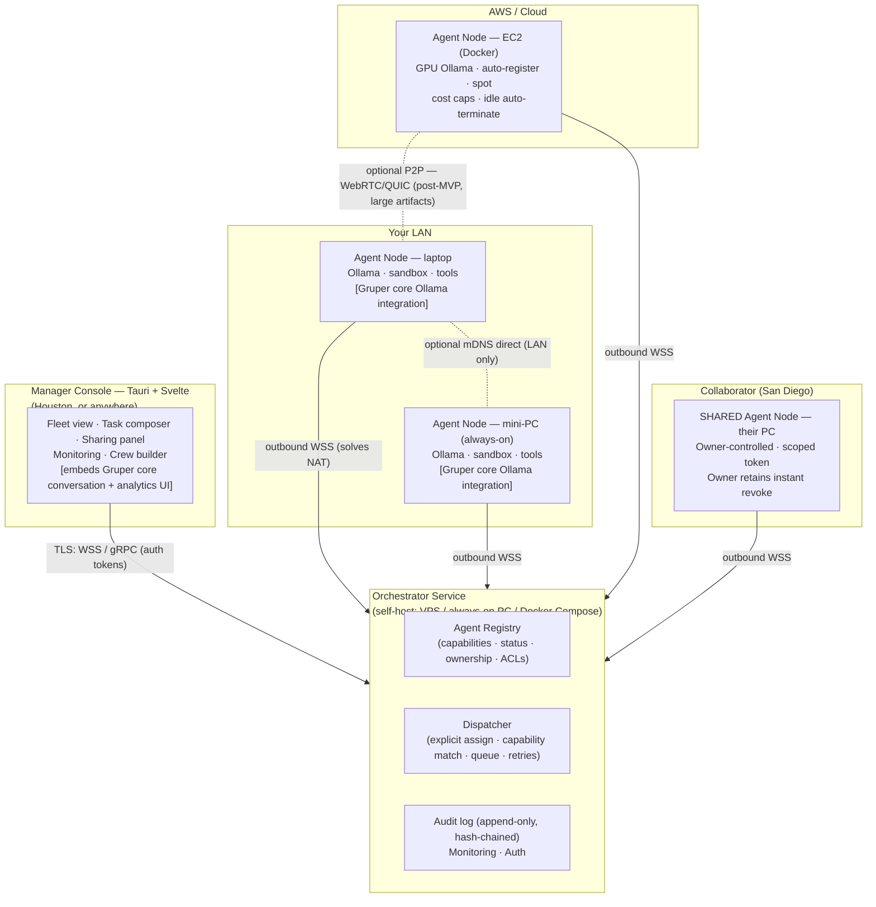
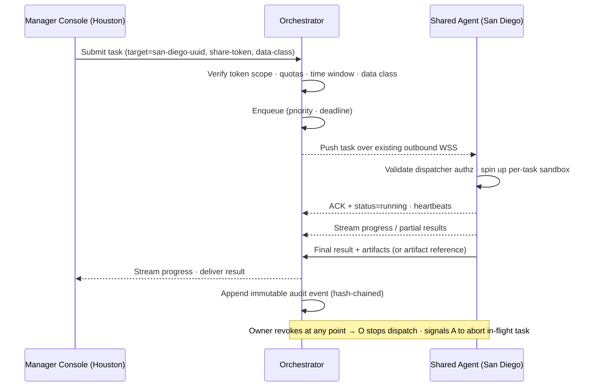
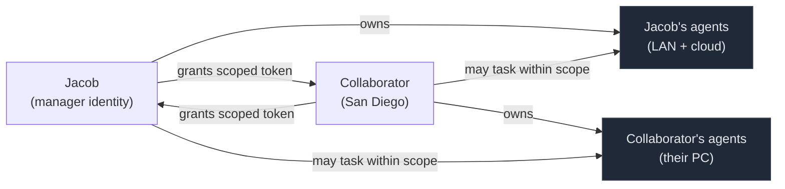
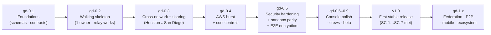

# Gruper Distributed — AI Workforce Platform

## A note on versioning (read this first)

**Gruper Distributed is pre-v1. This document is not a "v2" spec. There is no v1 yet.**

Gruper *core* is at v0.4.5 — a mature, stable, single-file application. The distributed extension described here has shipped nothing. It begins at the design stage. v1.0 is a *future finish line*, not a starting point.

This project uses a pre-release milestone track to stay honest:

| Track | Meaning |
|-------|---------|
| **`gd-0.1` … `gd-0.9`** | Pre-release design and build milestones. **This is where we are.** |
| **`gd-1.0` (v1.0)** | Declared only when the first stable release ships — installable agent runtime, working orchestrator, working cross-network sharing, security model validated, real users running it. The roadmap is rewritten at that point. |
| **`gd-1.x+`** | Post-v1 hardening, federation, and ecosystem expansion. |

All version numbers in this document refer to pre-1.0 milestones. The roadmap (§11) is built toward that finish line, not from it.

> **Working name:** "Gruper Distributed" is the working name through the pre-release track. Final branding decisions happen closer to v1.0. See the reflection appendix for alternatives.

---

## Executive Summary

**Gruper Distributed** is a secure, local-first platform for deploying and orchestrating fleets of AI agents that act as virtual employees, managers, researchers, analysts, and automation specialists. It is a **companion extension of Gruper core** — not a replacement, not a rewrite.

Gruper core (v0.4.5) already delivers up to six configurable AI agents in a single browser file: local Ollama/LocalAI inference, conversation memory, consensus detection, an analytics dashboard, 12 agent role templates, and a streamlined glassmorphism UI. It is deliberately client-only, requires no server, and opens with a double-click. Gruper Distributed preserves that local-first philosophy and reuses its patterns directly — but it answers a question core cannot: *what if your agents don't all have to run on this one machine, on this one network?*

**The headline capability** is that agents are no longer confined to a single user's local network:

- **LAN agents** — your desktops, laptops, and always-on mini-PCs (Intel NUC, Beelink) at home or in the office.
- **Cloud agents** — AWS EC2 instances (Dockerized, auto-registering, spot-friendly), including GPU inference instances for heavy workloads.
- **Permissioned cross-user agents** — you, in Houston, can add a trusted collaborator's computer in San Diego as an assignable agent in your fleet and task it directly. They can do the same with yours. The remote machine appears in your Manager Console as a first-class, scoped resource — no shared LAN, no port forwarding, no screen sharing, no VPN configuration required.

This turns idle personal hardware and cheap cloud burst into an **elastic, location-independent AI workforce grid.** Tasks — research synthesis, protocol analysis, data processing, report generation, document drafting, scheduling — can be explicitly assigned to a specific remote agent or routed to a capability-matched pool, with live monitoring, queuing, result streaming, and a full audit trail.

The system is designed for users who cannot afford the privacy and compliance risks of centralized SaaS AI, but who need more compute and geographic flexibility than a single machine provides. Target users include:

- **Solo operators and small consulting businesses** (10–20 person scale) scaling AI-assisted workflows without surrendering control.
- **Pharma startups and biological research labs** — protocol optimization pipelines, experiment data analysis, tissue culture workflow extensions (building on SteloPTC patterns), and compliance audit trails for regulated environments.
- **Astronomy observatory renters and remote science teams** — overnight data processing agents, scheduling automation, and remote telescope monitoring without requiring an on-site operator.
- **Trusted collaborator networks** who want to share idle compute across geographic boundaries while retaining owner sovereignty over their machines.

The system prioritizes **privacy** (Ollama local inference first, on-prem by default), **security** (per-task sandboxing, fine-grained sharing ACLs, instant revocation, and end-to-end payload encryption for cross-user tasks), **usability** (one Tauri desktop console, one-click installers, QR/share-token onboarding), and **integration with the existing stack** (n8n workflows, SteloPTC-style structured data discipline, and Gruper core's proven conversation engine, analytics UX, and reliability patterns).

---

## 1. Vision, Goals, Non-Goals & Success Criteria

### 1.1 Vision

A trusted person — not a faceless cloud platform — should be able to lend you an AI worker. Your fleet should span your desk, your closet mini-PC, a spot GPU in `us-west-2`, and a colleague's workstation two time zones away, and it should *feel like one console*. Local and private by default; distributed and elastic when you choose; always under explicit, revocable, auditable control.

For a pharma startup running overnight protocol optimizations, a biological lab tracking cross-site specimen experiments, or an observatory team processing a night's imaging run from a remote location — the same infrastructure should serve all of them. The underlying need is identical: trustworthy agents running on the right hardware, without requiring a permanent IT department.

### 1.2 Primary Goals

- **True distributed agent execution** across heterogeneous environments and ownership boundaries — your LAN, the cloud, and other people's machines.
- **The "not just my own network" requirement, concretely:** a Manager Console in Houston can task an agent on a collaborator's PC in San Diego, or on AWS GPU instances in `us-west-2`, over the public internet, with no inbound networking required on the agent side.
- **Symmetric, owner-controlled sharing** — vice-versa assignment with granular scoping and an instant kill switch.
- **Leverage existing hardware** — idle collaborator laptops, gaming PCs, home servers — plus cheap cloud burst (spot instances, idle-time GPU).
- **Keep sensitive workloads local or on explicitly trusted nodes** — cloud only for non-sensitive parallel work, enforced by data-class policy.
- **Build directly on what already works** — Gruper core's local Ollama integration, conversation engine, 12 agent role templates, analytics patterns, and circuit-breaker reliability discipline; SteloPTC's Tauri/Svelte UI patterns; and the current n8n + Ollama automation stack.

### 1.3 Non-Goals (for the pre-1.0 track)

- **No fully decentralized / blockchain marketplace.** A public trustless compute grid is out of scope until well after v1.0.
- **No open, anyone-can-join grid.** Sharing starts closed and invite-only. Strangers cannot dispatch to your machines.
- **No arbitrary untrusted code execution.** Everything runs sandboxed and ACL-gated; the trust model assumes a known, vetted collaborator circle.
- **No replacement of Gruper core.** Core stays single-file, client-only, and standalone. Distributed is a *separate companion system* that reuses core's patterns and optionally embeds its UI. Core does not grow a backend.
- **No mobile-first console** until the desktop console is solid. Mobile monitoring comes later.

### 1.4 Success Criteria

These are the acceptance bar for the first stable release. v1.0 is declared only when all of these hold for real users.

| # | Criterion | Target |
|---|-----------|--------|
| SC-1 | Time to add a remote agent (San Diego PC or AWS) to a fleet and receive its first task result end-to-end | **< 5 min** from install |
| SC-2 | Dispatch overhead for a remote task, excluding model execution time | **< 5–10 s** typical |
| SC-3 | Owner revocation of a shared agent takes effect | **Immediately** — no new tasks accepted; in-flight tasks killable |
| SC-4 | All traffic authenticated, encrypted, and auditable | **100%** of connections; no anonymous dispatch |
| SC-5 | Works behind consumer NAT, corporate firewalls, and AWS without inbound ports | **No port forwarding ever required on agents** |
| SC-6 | Sensitive task never leaves an unauthorized boundary | **Policy-enforced**; confidential tasks routed only to compliant agents |
| SC-7 | Field laptop loses internet mid-task | **Local queue survives**, syncs on reconnect, no data loss |

---

## 2. Key Use Cases

### UC-1 — Cross-City Direct Assignment (Houston ↔ San Diego) — *the defining case*

You (Houston) have a multi-hour research and synthesis task. Your collaborator in San Diego runs the agent runtime on a 64 GB / RTX 4090 workstation. From your Manager Console you assign the task **directly to their machine** — it runs against their local Ollama using the model capabilities you specified. Their agent streams progress; you receive the final report and artifacts. You never RDP, screen-share, or touch their network config. They granted you a scoped share token; they can revoke it in one click.

### UC-2 — Hybrid Local + Cloud Burst

Daily lightweight interactive work runs on your laptop and home mini-PC (low latency, private, Ollama-local). For a large parallel analysis job — say, screening 200 protein variants for a pharma client — you spin up 4× AWS spot GPU instances as `DataCruncher` agents. They auto-register on boot, appear in your fleet, accept partitioned work, and self-terminate on idle timeout when the queue drains, with a hard budget cap enforced before the first instance launches.

### UC-3 — Employee / Contractor Compute Contribution

A part-time researcher in another state installs the desktop agent on their personal laptop. You grant them the right to submit certain task types to your agents; they grant you the right to assign research tasks to their machine during agreed hours only. Both sides can audit every task dispatched. Mutual benefit, explicit scope, instant revocation available to either party.

### UC-4 — Hierarchical Manager Agents

A "Lead Researcher" meta-agent on your always-on orchestrator decomposes a goal, assigns sub-tasks to the best available agents (local for low-latency context gathering, the San Diego high-RAM box for heavy model inference, AWS for parallel web research), aggregates results, and delivers the final output. The human manager assigns the goal to the manager agent; the manager agent dispatches to worker agents across ownership boundaries, within the scopes its token allows. Every dispatch is auditable.

### UC-5 — Pharma / Biotech Protocol Pipeline

A pharma startup needs overnight protocol optimization runs on experimental data. A Lead Protocol agent decomposes the analysis, routes sub-tasks to local high-RAM agents for sensitive patient-adjacent data (US jurisdiction, on-prem only), and to cloud agents for publicly derived reference data. Every agent invocation, parameter set, and result is logged immutably to the hash-chained audit log — producing a compliance record. The Manager Console mirrors SteloPTC's structured-data discipline: inputs and outputs are typed, validated, and traceable.

### UC-6 — Biological Lab / SteloPTC Extension

A tissue culture lab running SteloPTC for specimen tracking extends its monitoring with Gruper Distributed agents: an always-on mini-PC agent watches sensor feeds and flags contamination risk events; a scheduler agent plans passage timelines and triggers n8n workflows for notifications. The distributed layer adds cross-site coordination — a second lab location's agent node participates in the same fleet, sharing specimen status data under a tightly scoped grant with explicit data-class restrictions.

### UC-7 — Astronomy Observatory Remote Operations

An observatory renter books telescope time overnight. A remote monitoring agent on the observatory's always-on node (running as a shared agent under a scoped grant to the renter) handles scheduling, telescope control callbacks, and anomaly detection. A processing agent on the renter's home workstation ingests imaging data as it arrives. The renter sees live task status from their laptop without staying awake — and can approve human-gated actions from their phone.

### UC-8 — Resilience / Offline Tolerance (rural TX, travel)

A field laptop loses internet mid-task. Locally-targeted tasks continue running from the on-device queue. When connectivity returns, the agent reconciles with the orchestrator: results uploaded, new assignments pulled, no data lost. The exponential-backoff reconnect pattern mirrors Gruper core's existing API retry discipline (2 s / 4 s / 8 s / 16 s), applied now to the persistent orchestrator connection rather than a single API call.

### UC-9 — On-the-Go Monitoring

A lightweight read-only view (later: PWA / Tauri mobile) lets you watch fleet status and approve human-gated actions from your phone between tasks. Out of scope for the first release; the data model must not preclude it.

---

## 3. Architecture Overview

### 3.1 The principle that makes cross-network work

**Every agent makes an *outbound* authenticated, persistent connection to an orchestrator. Nothing ever connects *into* an agent.**

This single decision is what lets a San Diego desktop, a corporate-firewalled laptop, and an AWS spot instance all participate identically. Outbound port 443 is allowed virtually everywhere; NAT is traversed by the agent dialing out; and the orchestrator becomes a reliable relay for pushing tasks and streaming results back. Direct peer-to-peer is an optimization added later — it is never a requirement for the system to function.

This relay model extends a pattern Gruper core already uses: core's agents dial out to a local Ollama endpoint and stream responses back over HTTP. Gruper Distributed generalizes that outbound-connection discipline to a persistent, authenticated orchestrator channel that works across any network boundary.

### 3.2 Component map



### 3.3 Request lifecycle (explicit cross-network assignment)



### 3.4 Trust topology



---

## 4. Component Breakdown — Agent Runtime (Worker)

The Agent Runtime is the program that turns a machine into an assignable AI worker. Its execution model and Ollama integration are **built directly on the patterns established in Gruper core**: the same local Ollama endpoint format, the same model parameter scheme (temperature, top-p, top-k, repeat penalty, max tokens, context length), and the same circuit-breaker / retry discipline. What changes is that the runtime now receives tasks from an orchestrator over a persistent connection rather than from a browser UI over an HTTP call.

### 4.1 Delivery paths

| Path | Targets | Packaging | Lifecycle |
|------|---------|-----------|-----------|
| **Desktop** | Windows / macOS / Linux laptops, desktops, mini-PCs | Tauri app + background service (systemd / launchd / Windows Service) | "Install as Agent Node" wizard; optional Ollama bootstrap; mDNS LAN discovery optional |
| **Container** | AWS EC2, VPS, on-prem servers, NUC/Beelink | Multi-arch Docker image (CPU + CUDA variants) | `docker run` or Terraform; reads env secrets; auto-registers on boot |

> **Cross-network enabler:** both paths execute the same outbound registration handshake. A desktop in San Diego and an EC2 instance in Oregon are indistinguishable to the orchestrator except for their reported capabilities and owner identity.

### 4.2 Installation UX

**Desktop:**
Single installer download → **"Install as Agent Node"** → background service installed, optional Ollama bootstrap, paste or scan an orchestrator URL + registration token (QR-code-friendly for non-technical collaborators). The agent dials out, registers, and appears in the owner's fleet within seconds.

**Container / AWS:**
```bash
docker run -d --restart=unless-stopped \
  -e ORCHESTRATOR_URL=wss://orch.example.com \
  -e REGISTRATION_TOKEN=*** \
  -e AGENT_TAGS="datacruncher,us-west-2" \
  -e ROLE="data_analyst" \
  --gpus all \
  ghcr.io/stelminado/gruper-agent:cuda
```
A Terraform module wraps this for spot fleets with idle auto-termination and hard budget caps.

### 4.3 Capabilities reported on registration

The capability schema extends Gruper core's per-agent configuration (model, parameters, role template) into a machine-level registration record the orchestrator uses for matching and ACL enforcement.

```json
{
  "agent_id": "uuid",
  "owner_id": "jacob-uuid",
  "name": "SanDiego-Workstation",
  "location_tag": "collab-san-diego",
  "jurisdiction": "US",
  "hardware": {
    "cpu_cores": 16,
    "ram_gb": 64,
    "gpu": "RTX 4090 24GB",
    "disk_gb": 2000
  },
  "models": ["llama3.1:70b", "qwen2.5-coder:32b"],
  "tools": ["code_interpreter", "web_search", "file_read", "n8n_webhook"],
  "roles": ["researcher", "data_analyst"],
  "network": { "type": "residential", "latency_class": "medium" },
  "availability": {
    "windows": ["Mon-Fri 09:00-18:00 America/Los_Angeles"]
  },
  "runtime_version": "gd-0.1.0",
  "status": "idle",
  "last_heartbeat": "2026-06-27T00:00:00Z"
}
```

`jurisdiction` and `availability` are present from the first milestone because they are required for compliance-driven data-class routing (pharma/biotech use cases), even if the matching logic is simple initially.

### 4.4 Execution model

1. Receives a task as JSON pushed over the persistent outbound connection.
2. Validates the dispatching authority against its local copy of the share-token / grant.
3. Spins up an **isolated per-task sandbox** (§8.3 — non-negotiable).
4. Runs the agent reasoning loop against the **local Ollama endpoint** (same API and parameter conventions as Gruper core), using OpenAI-compatible function calling so tools are portable.
5. The loop starts as a **custom ReAct / plan-execute implementation** whose task/state schema is designed to accept a graph-engine replacement (LangGraph-style) without breaking the wire contract (see OQ-1).
6. Streams incremental progress, partial output, and a final result + artifacts back to the orchestrator, which relays them to the submitter.
7. Maintains **heartbeats and resumable checkpoints** for long-running tasks — critical for offline-resilience (UC-8) and observatory overnight runs (UC-7).

Gruper core's circuit-breaker pattern (agent auto-disables after three consecutive failures) is carried forward: a runtime that fails repeatedly on a task type marks itself degraded and signals the orchestrator to stop routing that task class until the operator acknowledges.

### 4.5 Sandboxing & safety

- **Filesystem:** per-task temp directory; read-only access only to explicitly approved paths.
- **Network egress:** per-role and per-grant allow-list; can be empty for fully offline agents.
- **Code execution:** restricted Python / JS interpreter with timeout, memory cap, import restrictions, and optional seccomp.
- **Approval gates:** high-impact actions (send email, external POST, spend money, write to regulated data) pause for human approval per configurable policy.

Sandbox parity across desktop and container is a first-class engineering concern — see §8.3 for why weak desktop sandboxing is the most likely source of security debt in cross-user deployments.

---

## 5. Component Breakdown — Orchestrator Service

The orchestrator is the registry, dispatcher, and auditor. It is the relay that makes cross-network assignment work without any inbound agent ports, and it is the trust enforcement point for every sharing ACL on every dispatch.

### 5.1 Recommended stack

| Concern | Pre-1.0 choice | Rationale |
|---------|----------------|-----------|
| Core service | **Python + FastAPI** for early milestones; **Rust (axum/tonic) port of hot paths** as load and security review demand | Fastest path to a working cross-network demo; Python's agent ecosystem velocity; Rust where memory safety and performance matter — consistent with the prototype-then-harden discipline |
| Transport | **WSS** (WebSocket over TLS) for agent connections; gRPC optional later | Universally NAT/firewall-friendly; straightforward to implement and debug |
| Task queue | **PostgreSQL** (`SKIP LOCKED` / `LISTEN-NOTIFY`) to start; Redis if throughput demands | One durable dependency, auditable, no premature infrastructure |
| Database | **PostgreSQL** (multi-user). **SQLite + Litestream** for single-user self-host. | JSONB for capability queries; easy Docker Compose self-host |
| Deployment | **Docker Compose** on a cheap VPS or an always-on PC | One-command self-host; no managed-cloud lock-in |

One orchestrator instance comfortably coordinates dozens to low-hundreds of agents — well beyond the 10–20-worker target scale.

### 5.2 Core responsibilities

- **Registry & lifecycle:** register, heartbeat, deregister; capability index for matching and routing.
- **AuthN/AuthZ:** identity verification and **share-ACL enforcement on every dispatch** (§8).
- **Task intake:** from the Manager Console, REST API, other agents (manager agents), and n8n webhooks.
- **Dispatch logic:**
  - *Explicit:* `assigned_agent_id = "san-diego-uuid"`.
  - *Capability/policy match:* "needs ≥ 32 GB RAM + `code_interpreter` + `researcher` role + `jurisdiction = US`."
  - *Cost/latency-aware:* prefer local for interactive work; AWS spot for batch.
  - *Queue management:* priorities, deadlines, retries, dead-letter handling.
- **Result and artifact collection** with streaming to the submitter.
- **Immutable audit logging** — hash-chained event stream (see §9; this is the compliance record for pharma/biotech/LLC needs).
- **Resilience hooks:** agent reconnect handling, offline reconciliation, multi-orchestrator failover interface present early — full federation deferred to post-v1.

### 5.3 Sharing / cross-user model

This is the single most consequential architectural decision. Two viable patterns:

**Pattern A — Shared multi-tenant orchestrator (RECOMMENDED for the first release)**

One orchestrator instance (self-hosted, or a small hosted service) serves all users. Each agent registers under its **owner's namespace**. An owner mints a **time-limited, scoped share token** for a specific agent or group. The recipient imports the token in their console; the agent appears in their fleet with the granted scope. All task traffic routes through the orchestrator; the owner retains a global kill switch.

*Why Pattern A first:* makes the "San Diego PC shows up in the Houston console" experience trivial, secure, and centrally auditable — the lowest moving-part count for the headline use case.

**Pattern B — Federated / direct-to-owner (post-v1)**

Each user runs their own orchestrator. Sharing authorizes the recipient's orchestrator to dispatch to a specific agent; the agent multi-homes or the owning orchestrator proxies. More private and more resilient, but materially more complex to build and debug.

> **Recommendation:** ship Pattern A. Design the data model and tokens so **Pattern B is reachable as an additive change** — agents already speak "outbound to an orchestrator"; multi-homing adds a second connection, not a rewrite. Mitigate Pattern A's central-trust risk with **E2E payload encryption to the target agent's public key** (§8.4) so the orchestrator relays tasks it cannot read.

---

## 6. Component Breakdown — Manager Console

**Tech stack:** Tauri v2 + Svelte 5 + Tailwind, consistent with SteloPTC. One codebase, native desktop feel, small binary. The console is the human operator's single pane of glass for the entire fleet.

**Gruper core integration — the key design choice:** the console **embeds Gruper core's conversation UI** as the per-agent interaction view. When you open an agent's detail panel and direct a reasoning session, you are looking at Gruper's conversation engine — the same round-based multi-agent loop, the same glassmorphism UI, the same keyboard shortcuts (`Ctrl+Enter` to dispatch, `Ctrl+A` for analytics) that core users already know. The console's fleet management, task composer, and sharing panel wrap around this embedded core; they do not replace it. Gruper core's Chart.js analytics dashboard is similarly embedded for per-agent and fleet-wide performance views.

### 6.1 Key screens

| Screen | Core integration | Purpose |
|--------|-----------------|---------|
| **Fleet Overview** | Reuses core's agent status concepts | Grid/list of all visible agents (owned + shared). Status badges, location tags, load, last-seen, ownership indicator. Optional map from `location_tag`. |
| **Agent Detail & Control** | **Embeds Gruper core conversation UI** for direct agent interaction | Specs, current task, live log stream, history, "Assign New Task," and (for owned agents) "Manage Sharing." The conversation pane is Gruper core. |
| **Task Composer** | Builds on core's task-input patterns | Natural language → structured task (AI-assisted) or form-based (prompt, input files, allowed tools, timeout, target agent or "best match," priority, data class). |
| **Crew / Workflow Builder** | Extends core's multi-agent round model to cross-machine | Visual graph: one agent's output feeds another, potentially on a different owner's machine. YAML/JSON import/export. |
| **Sharing Panel** | New in Distributed | Generate/revoke tokens; see who can access your agents; set per-recipient scope (task types, quotas, time windows, approval requirements, data class, jurisdiction). |
| **Monitoring & Analytics** | **Extends Gruper core's Chart.js dashboard** | Success rate, latency by agent/location, cloud cost, utilization heatmaps, queue depth. Same visual language and export formats (CSV/JSON) as core. |
| **AI Co-Pilot Mode** | Extends core's consensus/meta-reasoning | Optional meta-agent suggests assignments or auto-dispatches routine work per configured policies. |

### 6.2 Mobile / on-the-go (post-v1 target)

A read-only PWA or Tauri-mobile view for fleet status and urgent approval taps — designed for monitoring between tasks without a laptop. Out of scope for the first release; the API and data model must not preclude it.

---

## 7. Component Breakdown — Communication & Cloud Integration

### 7.1 Communication layer

| Mode | Mechanism | Role |
|------|-----------|------|
| **Internet relay (always works)** | Agent dials outbound WSS to orchestrator on startup; maintains it with auto-reconnect and exponential backoff (mirroring Gruper core's 2 s / 4 s / 8 s / 16 s retry pattern); offline queue; heartbeats keep NAT mappings alive | **The default and the cross-network workhorse.** No inbound rules ever required. |
| **LAN direct (optional, zero-config)** | mDNS/Bonjour discovery; direct WSS/QUIC for lowest latency | Local clusters in one home or office; speed optimization, not required for correctness |
| **Direct P2P (post-MVP)** | Orchestrator brokers ICE (STUN + optional TURN relay); WebRTC DataChannel or QUIC direct after introduction; **falls back to relay automatically** | Large artifact transfers, high-bandwidth agent-to-agent handoff. Added only after the relay path is proven solid. |

**Authentication and encryption:** every connection is authenticated (signed registration + short-lived token); TLS 1.3 on all channels; sensitive task payloads encrypted client-side to the **target agent's public key** for true end-to-end confidentiality even when routed through a shared orchestrator (§8.4).

### 7.2 AWS / cloud integration

- Pre-built multi-arch Docker image (CPU + CUDA variants) with the agent runtime and optional bundled Ollama.
- Launch templates and Terraform for common instance types (`t3` for light CPU work; `g4dn` / `g5` for GPU inference; **spot instances by default** for cost control).
- Boot sequence: read `ORCHESTRATOR_URL`, `REGISTRATION_TOKEN`, `AGENT_TAGS`, `ROLE` from environment or mounted secret → auto-register → appear in fleet.
- **Cost controls are first-class, not an afterthought:** idle-timeout auto-terminate; orchestrator "drain and stop" signal; hard per-pool budget caps with alerts before launch; queue-depth-driven scaling via Lambda or a scheduler. Spend cannot exceed the configured cap.
- Portability: the same container image runs on Hetzner, RunPod, or Vast.ai — one abstraction, multiple cloud backends.

### 7.3 Tool and integration ecosystem

Agents expose an OpenAI-function-calling-compatible tool interface. Tools are extension points; they are not the agent loop.

| Tool | Notes |
|------|-------|
| `code_interpreter` | Sandboxed Python / JS; approved libraries only; memory + time limits |
| `web_search` | Tavily / self-hosted SearxNG / Brave; privacy toggle per task |
| `file_system` | Scoped read/write in task workspace or explicitly approved directories |
| `n8n_webhook` / `http_request` | Trigger existing n8n workflows or any HTTP API; bidirectional |
| `email_send` / `slack_post` | Approval-gated; scoped credentials per agent |
| `vector_store` | Local LanceDB or Chroma per agent; optional shared read-only knowledge base |

**n8n synergy:** agents become powerful reasoning nodes inside existing n8n workflows, and entire agent crews can be triggered from n8n. n8n handles deterministic automation; agents handle reasoning, research, and unstructured work. Neither replaces the other.

---

## 8. Security, Privacy & Trust Model

This section is the load-bearing wall of the cross-user design. The goal is that you can hand a collaborator a *scoped, revocable* AI worker — not root access to your machine. Getting this wrong means the product is either unsafe to share or too paranoid to be useful.

### 8.1 Identity and ownership

- Each user has a root identity: an **ed25519 keypair** (optionally OAuth-backed for recovery and onboarding UX).
- Each agent is **cryptographically bound to its creating owner** at registration — the owner's private key signs the registration, and the orchestrator records the corresponding public key as the agent's identity anchor.
- **Share tokens** are signed capability tokens (JWT or biscuit-style) encoding: target `agent_id`(s), grantee `user_id`, allowed action scopes, quotas, expiry, and conditions. They are presented on every dispatch and verified by the orchestrator before any task is queued.

### 8.2 Sharing and permissioning

**Owner sovereignty:** the owner can view every task ever run on their agent and **revoke any grant instantly** — the orchestrator stops dispatching immediately and signals the agent to drop or abort the current task. There is no grace period.

**Granular scope examples:**

| Scope dimension | Example value |
|-----------------|--------------|
| Task categories | `["research","analysis","writing"]` — explicitly excludes `execute_arbitrary`, `email_external` |
| Resource limits | max 2 concurrent tasks; ≤ 16 GB RAM per task; ≤ 2 h wall time |
| Time windows | weekdays 09:00–18:00 owner-local time only |
| Data classification | only tasks tagged `public` or `internal`; never `confidential` |
| Result visibility | grantee receives final output; intermediate logs and tool call details are not exposed |
| Jurisdiction | tasks tagged `confidential` may not be dispatched to non-US agents under this grant |

The grantee's console shows shared agents with a clear "shared / limited" indicator. Actions not covered by the token are not surfaced in the UI.

### 8.3 Sandbox and containment — parity is non-negotiable

**Every task on every agent type runs isolated:**

- Separate filesystem namespace / tmpfs per task.
- Dropped Linux capabilities.
- seccomp / AppArmor / SELinux profiles on desktop; container runtime defaults on cloud.
- Network egress allow-list (empty for fully offline agents; restrictive by requirement for agents handling regulated data).
- cgroup-enforced CPU, memory, and wall-time limits.

**Desktop and container sandbox containment must be demonstrably equivalent — this is an engineering requirement, not an aspiration.** Cross-user sharing means a weak desktop sandbox on a collaborator's machine is a risk for the entire fleet, not just their own tasks. Container sandboxing is well-understood; desktop sandboxing (Firejail on Linux, Windows Job Objects / WinSandbox on Windows, App Sandbox on macOS) requires explicit, tested, per-platform configuration. This is addressed at the `gd-0.5` security milestone with a mandatory cross-platform validation pass. **Cross-user sharing does not ship with unvalidated desktop sandboxing.**

No task can affect another task's state or the host OS except through explicitly provisioned tools.

### 8.4 Data protection and end-to-end encryption

**Data-class routing:** tasks tagged `confidential` route only to agents whose owner, jurisdiction, and posture satisfy policy ("US only," "on-prem only," "encrypted at rest required"). Enforced by the orchestrator at dispatch time — not a best-effort suggestion.

**E2E payload encryption** is a **first-class security requirement**, not an optional add-on. With Pattern A (shared orchestrator), the orchestrator sees task metadata but need not see task content. When the submitter encrypts the task payload to the **target agent's ed25519-derived public key** (X25519 key agreement + ChaCha20-Poly1305), the orchestrator relays ciphertext it cannot read. This directly mitigates Pattern A's central-trust risk and is a required exit gate of the `gd-0.5` milestone.

For pharma and biotech users processing regulated or patient-adjacent data, E2E encryption combined with on-prem-only routing and the hash-chained audit log is the minimal viable compliance posture. Observatory and astronomy users typically have lower sensitivity requirements but benefit from audit trails for reproducibility and run attribution.

**Audit log:** records who assigned what to which agent, when, with what scope, and the high-level outcome. Sensitive payload content is redacted or hashed. The log is append-only and hash-chained (each event includes the hash of the previous event) for tamper-evidence — this is the compliance record for LLC recordkeeping and regulated-industry audits.

### 8.5 Threat model and mitigations

| Threat | Mitigation |
|--------|------------|
| Shared-agent owner reads your task content | E2E payload encryption to target agent key; data-class routing prevents confidential tasks from reaching lower-trust agents |
| Grantee abuses your agent (resource theft, scope escalation) | Per-grantee quotas, scoped tokens, time windows; instant revoke; full audit log; cgroup hard limits |
| Compromised orchestrator (Pattern A risk) | Agents execute only signed, authorized dispatches; E2E encryption protects content even if orchestrator is read; local/LAN-direct mode as fallback |
| Weak desktop sandbox on a collaborator's machine | Mandatory cross-platform sandbox validation at `gd-0.5`; desktop agents default to the most restrictive available profile; cross-user sharing blocked until validation passes |
| Rogue manager agent over-delegates | Manager agents inherit a *strict subset* of their human principal's scopes; they cannot exceed the authority they were granted; all dispatches are audited identically to human dispatches |
| Supply chain / dependency attacks | Minimal base images; reproducible builds; SBOM; pinned dependencies with SRI-style hash verification — mirrors Gruper core's CDN SRI-hash discipline applied to container layer integrity |
| AWS cost overrun | Hard budget caps enforced before instance launch; spot-by-default; idle auto-terminate; orchestrator drain-and-stop signal |

---

## 9. Data Models

**User / Identity**
`id, pubkey (ed25519), display_name, org_id (optional), recovery_method (optional OAuth), created_at`

**Agent**
`id, owner_id, pubkey, name, location_tag, jurisdiction, capabilities (JSONB), availability (JSONB), share_policies (JSONB[]), status, runtime_version, last_seen, created_at, metadata (JSONB)`

**Task**
`id, correlation_id, submitter_id (user|agent), assigned_agent_id, parent_task_id, data_class, input (JSON | encrypted blob), allowed_tools, status, priority, deadline, created_at, dispatched_at, completed_at, result (JSON|ref), logs_ref, cost_cents, audit_hash`

**ShareToken / Grant**
`id, agent_id[] (one or more), grantee_user_id, scopes[], quotas (JSON), conditions (JSON: time_windows, allowed_data_classes, jurisdiction_require), expires_at, revoked_at, created_by`

**Event (audit — append-only)**
`id, ts, actor_id, action, subject_id, payload_hash, prev_hash`
Hash-chaining (`prev_hash` references the hash of the prior event) provides tamper-evidence without a blockchain — this is the compliance record for LLC bookkeeping, pharma audit trails, and observatory run logs.

**Storage:** PostgreSQL + JSONB centrally for query power; SQLite per agent for its local queue and offline buffer. Artifact bytes go to object storage or are returned by reference (presigned URL / local HTTP server), not inlined past a configurable size threshold — see OQ-4.

---

## 10. Technology Recommendations & Rationale

| Component | Recommendation | Why |
|-----------|----------------|-----|
| Desktop UI / installer | **Tauri v2 + Svelte 5 + Tailwind** | Existing expertise (SteloPTC); native feel, small binary, Rust backend available when needed |
| Agent conversation view in console | **Embed Gruper core's conversation UI** | Reuse six months of debugged multi-agent UX, analytics, and keyboard shortcuts rather than rebuilding |
| Agent runtime core | **Python agent loop first; Rust (PyO3 bridge or port) for sandbox and comms hardening** | Python = fastest agent-framework iteration; Rust where memory safety matters — prototype-then-harden |
| Orchestrator | **FastAPI + PostgreSQL first; Rust (axum/tonic) port of registry and dispatch hot paths** | Quickest working cross-network demo; harden incrementally under load and security review |
| LLM inference | **Ollama-first** (same local endpoint and parameter conventions as Gruper core); cloud fallback optional and explicit | Privacy, cost control, offline capable; consistent with existing stack |
| Workflow automation | **n8n (existing) + native agent graphs** | Don't rebuild working automation; agents become powerful reasoning nodes inside existing n8n flows |
| Containerization | **Docker, multi-arch (linux/amd64 + linux/arm64; CPU + CUDA variants)** | AWS, VPS, desktop sandbox, and NUC/Beelink consistency |
| LAN discovery | **mDNS (Bonjour / Avahi)** | Zero-config local clusters; no configuration required |
| Transport | **WSS now; gRPC and WebRTC/QUIC as later optimizations** | Reliable universal relay first; direct P2P only after relay path is proven in production |
| Identity / auth | **ed25519 keypairs + signed capability tokens (JWT or biscuit)** | Strong identity, federation-friendly, owner-sovereign, no third-party auth dependency |
| Storage | **Central PostgreSQL + per-agent SQLite** | Query power and JSONB flexibility centrally; privacy and offline buffering at the edge |

**Phased tech posture:** prototype the full cross-network path in Python to reach a working Houston → San Diego demo as fast as possible. Port security-critical and high-throughput components to Rust once the relay model is validated in production. Add direct P2P, federation, and gRPC only after the WSS relay path is solid.

---

## 11. Phased Implementation Roadmap (toward a future v1.0)

**Framing:** This roadmap is a path to a first stable release. Each milestone is a pre-release tag (`gd-0.x`) with an explicit exit gate. **v1.0 is declared only when the Success Criteria (§1.4) hold for real users** — at which point this roadmap is rewritten to record that we have reached v1. We are currently at `gd-0.0`: design.



---

### `gd-0.1` — Foundations *(design and contracts)*

**Goal:** lock the interfaces everything else is built against.

- Finalize this spec, data models, and **wire contracts**: OpenAPI schema for the console REST/WS API; the agent↔orchestrator WSS message schema (register, heartbeat, task-push, progress-stream, result, revoke).
- Map **Gruper core's agent configuration schema** (model, temperature, top-p, top-k, repeat penalty, max tokens, context length, role template) to the distributed task input schema — this is the formal bridge between core's local parameter model and the remote execution contract.
- Stand up a skeleton FastAPI orchestrator + PostgreSQL via Docker Compose: one endpoint (`/register`), one WebSocket handler (`/agent/ws`), basic JWT issuance.
- Decide OQ-1 (agent-loop framework) so the task/state schema can be frozen.

**Exit gate:** schemas reviewed and agreed; an agent can register and heartbeat; no tasks dispatched yet.

---

### `gd-0.2` — Walking skeleton *(single owner, relay proven)*

**Goal:** prove the outbound-relay model works end-to-end over the public internet.

- One desktop agent dials out, registers, receives an explicitly-assigned task via WSS push, runs it against the **local Ollama endpoint using Gruper core's existing API integration pattern** (same `/api/generate` or `/api/chat` call shape, same parameter passing), and streams the result back.
- Minimal Tauri console (Svelte 5): one agent card, one task form, one result view. The result view is **Gruper core's conversation message rendering**, embedded directly — not reimplemented.
- Offline queue stub: tasks queued locally when the orchestrator is unreachable, drained on reconnect with exponential backoff.
- Per-agent analytics tab begins as **Gruper core's Chart.js response-time chart** scoped to that agent's task history.

**Exit gate:** end-to-end task on your *own* machine over the internet relay path (not just LAN direct). This proves SC-5 for the single-owner case and validates the relay model before sharing is added.

---

### `gd-0.3` — Cross-network + sharing *(the headline milestone)*

**Goal:** UC-1 (Houston → San Diego) works for real.

- Pattern A multi-tenant orchestrator: user namespaces, agents-under-owners, **scoped share token minting and import**.
- Token import UX: paste a token string or scan a QR code → the shared agent appears in the fleet with its granted scope and a clear "shared / limited" badge.
- A real second person's machine (the San Diego collaborator) installs the desktop agent, receives a share token, and executes a task assigned from Houston. **Instant revoke is tested.**
- The task flow runs against **the remote agent's local Ollama**, using the same model parameter schema from `gd-0.1` — the submitter specifies model preferences; the agent uses its closest available match.
- Manager-agent delegation: a meta-agent dispatches sub-tasks using a *subset* of the human principal's scope; the console shows the delegation chain.

**Exit gate:** UC-1 works with a real second person on a real second machine over the public internet. SC-1, SC-3, and SC-5 are demonstrably met. Token generation, scoping, and revocation require no command-line steps.

---

### `gd-0.4` — AWS burst + cost control

**Goal:** UC-2 (cloud burst) works with hard spending guarantees.

- Multi-arch Docker image published (`CPU + CUDA`); Terraform module for spot fleet launch.
- Boot sequence: env vars → auto-register → appear in fleet; idle auto-terminate; orchestrator "drain and stop" signal.
- **Hard budget caps enforced before first instance launch** — the orchestrator refuses to dispatch to a pool if its cost cap would be breached.
- Queue-depth-driven scale-out hook (Lambda or simple scheduler polling the orchestrator's queue API).
- Per-agent cost tracking in the analytics dashboard, extending **Gruper core's Chart.js analytics** with a cost dimension for cloud agents.

**Exit gate:** UC-2 works; spend cannot exceed the configured cap under any queue-depth scenario tested.

---

### `gd-0.5` — Security hardening

**Goal:** cross-user sharing is safe enough for real sensitive workloads — pharma, biotech, regulated data.

- **Per-task sandboxing across all platforms:** Firejail (Linux desktop), Windows Job Objects / WinSandbox (Windows), App Sandbox (macOS), container defaults (cloud). Desktop and container containment must be demonstrably equivalent — this is the exit gate condition, not a best-effort goal.
- Egress allow-lists per role and per grant; cgroup limits enforced in all environments; approval gates for high-impact tool calls.
- **E2E payload encryption:** submitter encrypts task payload to the target agent's public key (X25519 + ChaCha20-Poly1305) before the orchestrator sees it. Orchestrator routes ciphertext; agent decrypts in the sandbox.
- Hash-chained audit log fully implemented and queryable from the console.
- Per-grantee quotas and data-class routing with jurisdiction enforcement.
- First formal **security review pass** of the codebase (using the repository's `/security-review` discipline).
- SRI-equivalent integrity pinning for Docker image layers in the Terraform module, mirroring **Gruper core's CDN SRI-hash validation** in CI.

**Exit gate:** SC-4 and SC-6 met; written threat-model review signed off; desktop sandbox parity validated on all three platforms; E2E encryption tested against a simulated compromised orchestrator.

---

### `gd-0.6–0.9` — Console polish, crews, and closed beta

**Goal:** the system is ready to hand to trusted collaborators for honest feedback.

- Capability-based and policy-based auto-dispatch alongside explicit assignment.
- Full fleet map, live log streaming, **crew / workflow builder** (visual graph editor for multi-agent pipelines spanning machines and owners), bidirectional n8n integration.
- Monitoring and analytics fully extended from Gruper core: per-fleet success rates, latency heat maps, agent utilization, queue depth — same **Chart.js visual language and CSV/JSON export** as core.
- **Closed beta with 2–3 trusted collaborators** across real geographic locations and use cases (a lab partner, an astronomy contact, a consulting collaborator).
- Documentation: install guide, sharing setup, ops runbook, and a security posture summary for collaborators to review before sharing their machine.

**Exit gate:** all seven Success Criteria met for beta users; documentation complete; no critical bugs open.

---

### v1.0 — First stable release

Declared when the `gd-0.9` exit gate holds for real users. The roadmap is rewritten at that point to record that we have reached v1.0. Until then, **this is the only place "v1" appears as a future target** — not a current state.

---

### `gd-1.x` — Post-v1 (later)

Federation (Pattern B) + agent multi-homing; direct P2P channels for large artifacts; cross-machine hierarchical crews with full scope inheritance; predictive AWS instance pre-warming; mobile companion app (PWA / Tauri mobile) for monitoring and approvals; opt-in agent directory with reputation signals.

No public trustless marketplace. No blockchain incentives. Keep the trust model closed-and-invited until there is a strong reason to open it.

---

## 12. Risks, Open Questions & Mitigations

### 12.1 Risks

| Risk | Mitigation |
|------|------------|
| Sharing abuse / resource theft | Quotas + instant revoke + sandbox hard limits; start with a small trusted circle before any broader rollout |
| Orchestrator bottleneck or single point of failure | Multi-orchestrator failover interface present early; agent-side offline queue; local/LAN-direct fallback; Pattern B as a post-v1 architecture path |
| LLM nondeterminism / agent loop errors | Structured outputs + output validation + retry logic + human approval gates on critical paths; extends **Gruper core's circuit-breaker discipline** to remote task execution |
| Install friction for non-technical collaborators (pharma staff, lab partners) | One-click installer, QR token scan, sane defaults, no command-line required for basic setup |
| AWS / cloud cost overrun | Hard caps before launch, spot-by-default, per-pool budgets with alerts, idle auto-terminate, drain-and-stop from orchestrator |
| **Desktop sandbox weakness in cross-user sharing** | Mandatory sandbox parity validation at `gd-0.5`; cross-user sharing does not ship until desktop sandbox is validated on all three platforms |
| **E2E encryption deferred too long** | E2E encryption is a `gd-0.5` exit gate — non-negotiable for real sensitive workloads, not a "nice to have later" |
| Scope creep into distributed-systems complexity | Ship Pattern A only; defer federation and P2P; protect the single-console simplicity that makes Gruper usable |
| Trust erosion if a collaborator's machine is compromised | E2E encryption, data-class routing, sandbox, audit log, instant revoke; shared agents are semi-trusted by default regardless of personal relationship |

### 12.2 Open Questions (resolve within `gd-0.1` — `gd-0.3`)

- **OQ-1.** MVP agent-loop framework: custom ReAct implementation (closest to how Gruper core's conversation engine is hand-built, maximum control) vs LangGraph vs CrewAI/AutoGen (faster framework-provided capabilities, more dependency)? This drives the Python/Rust split and locks the task/state schema. *Recommendation: custom ReAct first, designed for later graph-engine replacement — consistent with Gruper core's hand-built approach.*
- **OQ-2.** Confirm **Pattern A** (shared multi-tenant orchestrator) for the first release. This shapes every downstream decision and needs explicit sign-off.
- **OQ-3.** Should agents support **multiple simultaneous orchestrator connections** from day one (federation-ready multi-homing), or single-homed initially with multi-homing added in `gd-1.x`?
- **OQ-4.** Artifact / result handling at scale: return by reference (presigned S3 URL or local HTTP), stream only, or store centrally encrypted — and at what byte-size threshold does behavior change?
- **OQ-5.** Depth of **n8n integration** in the first release: deep bidirectional (agents call n8n workflows; n8n triggers agents), or treat agents as opaque tool-callers initially and add bidirectionality in `gd-0.6+`?

---

## 13. Glossary

- **Agent Node** — a machine (PC, laptop, server, EC2 instance) running the Gruper Distributed agent runtime and participating in one or more fleets.
- **Gruper core** — the stable, single-file, client-only multi-agent conversation system (Gruper.html, v0.4.5); the foundation this project extends without modifying.
- **Orchestrator** — the coordination service holding the agent registry and dispatching tasks; the relay that enables cross-network assignment without inbound ports.
- **Manager Console** — the Tauri/Svelte desktop application through which a human (or meta-agent) views the fleet and submits work; embeds Gruper core's conversation UI and Chart.js analytics.
- **Share Token / Grant** — a cryptographically signed, scoped, time-limited, instantly-revocable authorization allowing a grantee to see and task a specific agent under defined constraints.
- **Capability Match** — automatic selection of agents whose reported hardware, tools, roles, jurisdiction, and availability satisfy a task's requirements.
- **Manager Agent** — an AI agent that decomposes goals and dispatches sub-tasks to worker agents, operating within a strict subset of its human principal's authority scope.
- **Data Class** — a label on a task (`public`, `internal`, `confidential`) that constrains which agents may receive it, enforced at dispatch time by the orchestrator.
- **Pattern A / Pattern B** — shared multi-tenant orchestrator (recommended for the first release) vs federated per-user orchestrators (post-v1 architecture path).
- **`gd-0.x`** — pre-release milestone tags for Gruper Distributed; all version numbers in this document are on this track until v1.0 is declared.

---

## 14. Next Steps for Refinement

1. **Sign off OQ-2 (sharing model).** Pattern A vs federated is the biggest fork in the road; everything downstream depends on it.
2. **Decide OQ-1 (agent-loop framework)** so the task and state schema can be frozen in `gd-0.1` and a contractor can build against a stable contract.
3. **Lock the wire contracts** (console OpenAPI spec + agent WSS message schema) — the deliverables of `gd-0.1` and the handoff artifact for any external implementation work.
4. **Confirm the closed beta circle** — 2–3 trusted collaborators across real locations (lab partner, astronomy contact, consulting peer) — so `gd-0.3` has real cross-network testers from the start.
5. **Confirm the working name** before any public artifacts, installers, or domain registrations use it.

*Gruper Distributed fully incorporates the requirement that the system is not limited to one's own network. It enables AWS agents and permissioned assignment of agents on other users' computers — the Houston ↔ San Diego case, the pharma lab cross-site case, the astronomy observatory remote case — forming a practical, auditable, owner-sovereign distributed computing fabric for AI managers and workers. It remains explicitly pre-v1 until the first stable release ships.*

**End of specification — Design Draft `gd-0.2`**

---
---

# Appendix — Reflection (not part of the specification)

*Kept separate from the spec body.*

---

### Most novel / highest-risk parts of the cross-user model

**1. Permissioned cross-owner dispatch with a trustworthy instant kill switch.**
The genuinely novel part is not "run an agent on a remote box" — that is table stakes. It is that a machine you *do not own* appears as a first-class, scoped, revocable worker in your console while the owner remains sovereign at all times. The risk concentrates in **share-token semantics and revocation guarantees**: if revoke is even slightly unreliable — by a few seconds or a missed edge case — trust collapses. If scopes leak (for example, a manager agent escalating beyond its granted authority), the sharing model breaks. This deserves the most careful design, the most adversarial testing, and the clearest UX signaling of what each token allows.

**2. Confidentiality on a shared / central orchestrator (Pattern A).**
Pattern A is the right call for implementation speed, but it means a central party relays task metadata. E2E payload encryption to the target agent's key is not optional polish — it is the load-bearing mitigation. Without it, "I'd run my client's protocol data through this" is an uncomfortable answer. With it, the orchestrator is a routing layer, not a data store. This is why E2E encryption is a `gd-0.5` exit gate rather than a `gd-1.x` wish.

**3. Desktop sandbox parity.**
Container sandboxing is well-understood. Desktop sandboxing across Windows, macOS, and Linux is not: it requires explicit, platform-specific configuration, and failure modes are subtle. Cross-user sharing means a weak sandbox on a collaborator's Windows laptop is a risk for your data. This is where security debt will hide if not addressed explicitly and early. The `gd-0.5` mandatory validation gate exists precisely because "we'll fix it later" is how sandbox bypasses end up in production.

---

### The single decision that determines whether it *feels* like real distributed computing

**Sub-10-second, observable dispatch over the outbound relay.**

If assigning a task to the San Diego box or an AWS GPU is one click, shows live progress within seconds, and requires no networking ceremony — it feels like one elastic computer. If it requires VPN setup, port forwarding, or produces a slow opaque "dispatching…" state that eventually times out — it feels like brittle remote SSH with extra steps, and no one will use it for real work.

Everything else in this spec — agent frameworks, P2P, federation, crew builders — is secondary to nailing that experience. The outbound relay model (§3.1 + §3.3) is the correct foundation; the engineering discipline is making the `gd-0.3` milestone feel *fast and transparent*, not just *functional*. Live progress streaming, clear "task dispatched to San Diego (waiting for model)" status, and sub-5-second acknowledgment are the differentiators, not the underlying protocol.

---

### Naming / positioning

The earlier draft drifted between "Gruper Distributed" and "SteloAgents." That ambiguity is resolved here: **Gruper Distributed** is the working name through the pre-release track. It anchors the extension to Gruper core (the thing that already works and has a track record), signals "distributed extension" rather than "unrelated new product," and avoids prematurely branding something that has not shipped.

If a distinct product identity is desired at or after v1.0, candidates worth considering: **Gruper Fleet** (clearest; evokes the fleet concept directly), **Gruper Grid** (evokes the elastic compute grid), or **Stelo Fleet** (ties to Stelminado and SteloPTC for a unified brand). Avoid "Mesh," "Nexus," "Distri-," or "Aether" — overused and carry no meaning in a cold introduction.

Positioning line: *"Gruper, extended. Your agents now live anywhere — your machines, the cloud, or a trusted colleague's computer — all in one console you control."*

---

### On scope discipline

Pre-v1 scope must be defended actively. Every compelling integration or extension idea belongs in the `gd-1.x` backlog until the relay model, cross-user sharing, and security hardening are proven in production with real users. The specification's value lies as much in what it *excludes* as in what it includes: a tight pre-v1 scope protects the single-console simplicity that makes Gruper usable and prevents architectural complexity from accumulating before the foundation is solid.

---

### Clarifying questions that would materially change the architecture

1. **OQ-2 (sharing model, restated):** Are you comfortable running or hosting a single shared orchestrator that all collaborators connect through for the first release? Or is "no central party ever touches my task metadata" a hard requirement before any real sharing? Pattern A vs forcing Pattern B early is the biggest architectural fork.

2. **OQ-1 (agent loop, restated):** Custom ReAct loop (consistent with Gruper core's hand-built philosophy, maximum control) vs adopting LangGraph or CrewAI (faster framework-provided capabilities, more external dependency)? This decision locks the task/state schema.

3. **Inference for shared agents:** when you task the San Diego machine, does it use the *owner's* installed Ollama models by default (you see what they have; you pick from their capability list), or can the *submitter* pin a specific model the remote machine may not have (requiring the agent to pull it on demand, with the latency and storage implications that entails)?

4. **E2E encryption timing:** is E2E payload encryption a `gd-0.3` blocker — no real sharing with real data until it exists — or is `gd-0.5` acceptable, with `gd-0.3` sharing explicitly limited to a trusted-circle, non-sensitive pilot?

5. **Trust baseline for the initial collaborator circle:** "people I'd give a spare house key" (semi-trusted; optimize for onboarding ease) or "paid contractors I don't fully trust" (optimize for sandbox and audit-first, stricter defaults)? This sets the aggression level for default sandbox profiles, data-class defaults, and whether the first sharing UI emphasizes convenience or explicit confirmation of each scope granted.
